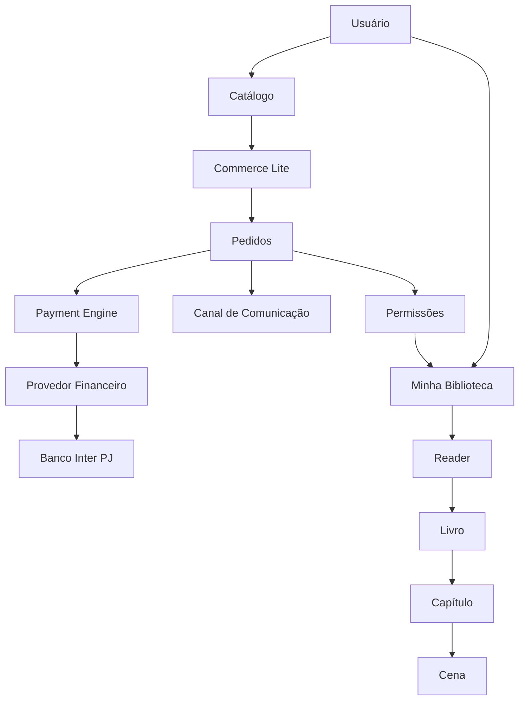

# DA-001 — Visão Geral da Plataforma

```mermaid
graph TD

    U[Usuário]

    U --> CAT[Catálogo]
    U --> BIB[Minha Biblioteca]

    CAT --> COM[Commerce Lite]

    COM --> PED[Pedidos]

    PED --> PAY[Payment Engine]
    PED --> COMMS[Canal de Comunicação]

    PAY --> FIN[Provedor Financeiro]
    FIN --> INTER[Banco Inter PJ]

    PED --> PERM[Permissões]

    PERM --> BIB

    BIB --> READER[Reader]

    READER --> BOOK[Livro]

    BOOK --> CHAP[Capítulo]

    CHAP --> SCENE[Cena]
```
