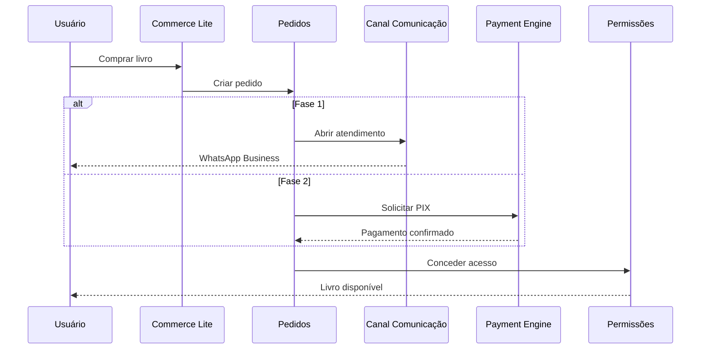

```mermaid
sequenceDiagram

    participant U as Usuário
    participant C as Commerce Lite
    participant P as Pedidos
    participant W as Canal Comunicação
    participant F as Payment Engine
    participant A as Permissões

    U->>C: Comprar livro

    C->>P: Criar pedido

    alt Fase 1
        P->>W: Abrir atendimento
        W-->>U: WhatsApp Business
    else Fase 2
        P->>F: Solicitar PIX
        F-->>P: Pagamento confirmado
    end

    P->>A: Conceder acesso

    A-->>U: Livro disponível
```
