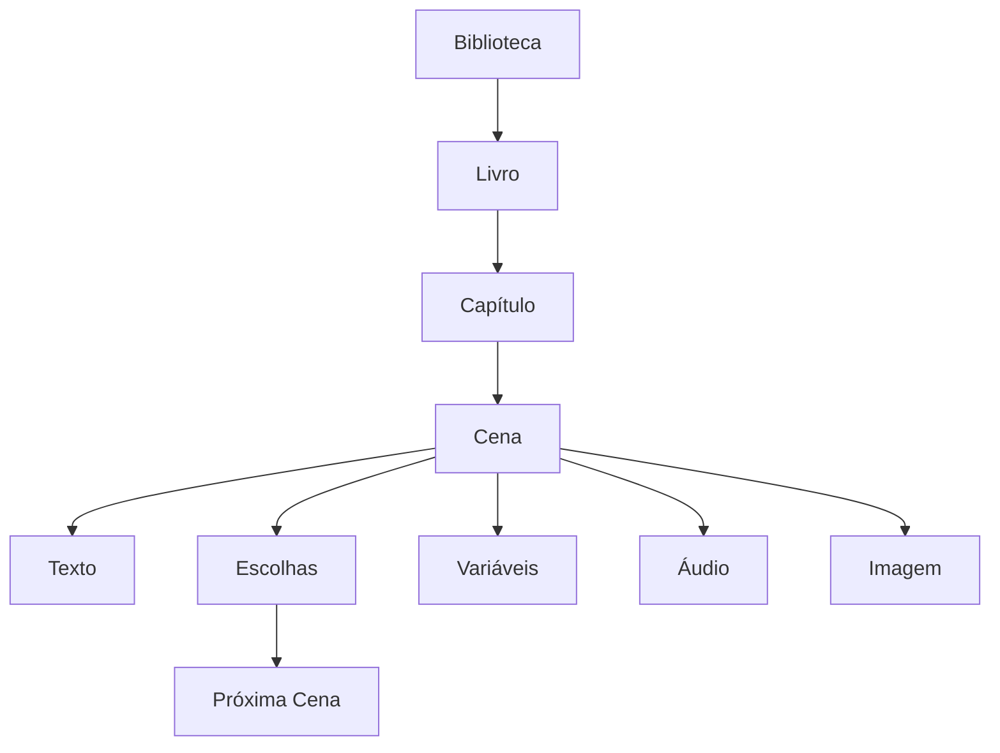

## DA-003 - Fluxo de Reader

```mermaid
flowchart TD

    B[Biblioteca] --> L[Livro]

    L[Livro] --> CAP[Capítulo]

    CAP --> C[Cena]

    C --> T[Texto]

    C --> E[Escolhas]

    C --> V[Variáveis]

    C --> A[Áudio]

    C --> I[Imagem]

    E[Escolhas] --> P[Próxima Cena]
```

