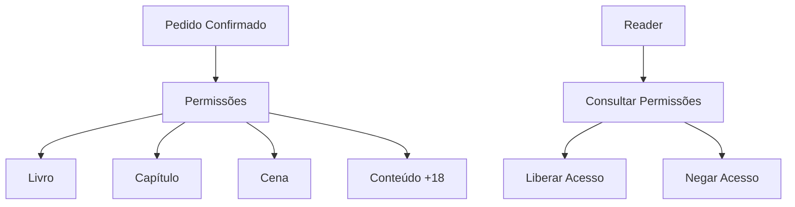

# DA-004 - Controle de Permissões

## Objetivo

Este diagrama representa o fluxo de validação de permissões antes da execução do conteúdo pelo Reader.



## Observações

- As permissões são concedidas após a confirmação do pedido.
- O Reader sempre consulta o módulo de Permissões antes de exibir qualquer conteúdo.
- As permissões podem ser aplicadas em diferentes níveis da estrutura da plataforma.
```
