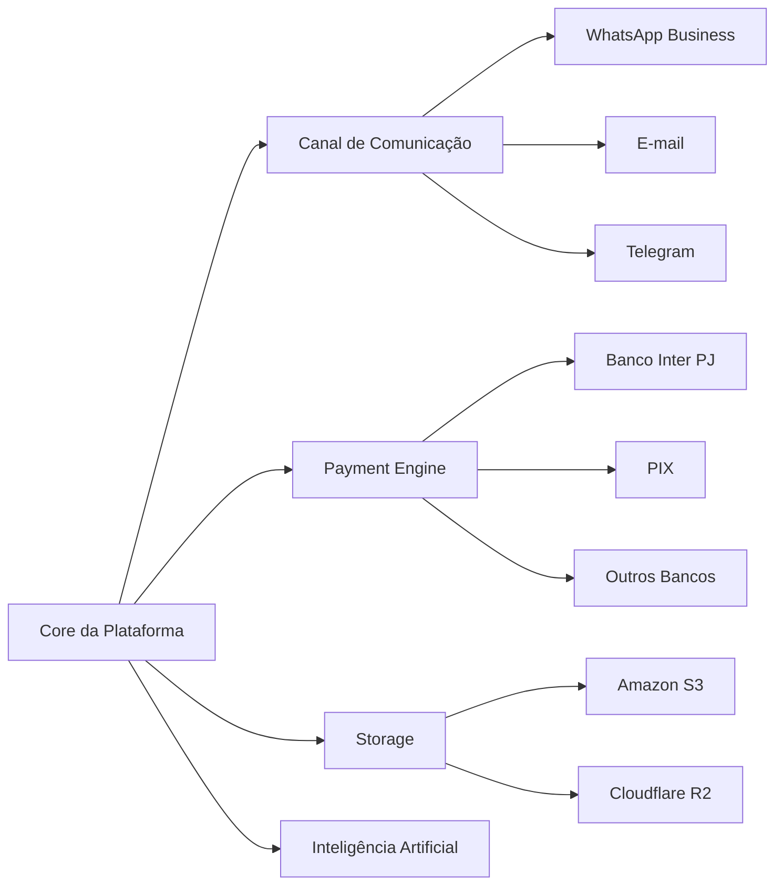

# DA-005 - Integrações Externas

## Objetivo

Este diagrama apresenta a relação entre o núcleo da plataforma e os serviços externos, preservando o baixo acoplamento da arquitetura.



## Observações

- O Core da Plataforma não depende diretamente de serviços externos.
- Cada integração deve ocorrer por meio de interfaces e adaptadores.
- Novos provedores podem ser incorporados sem alterar as regras de negócio da plataforma.
```
