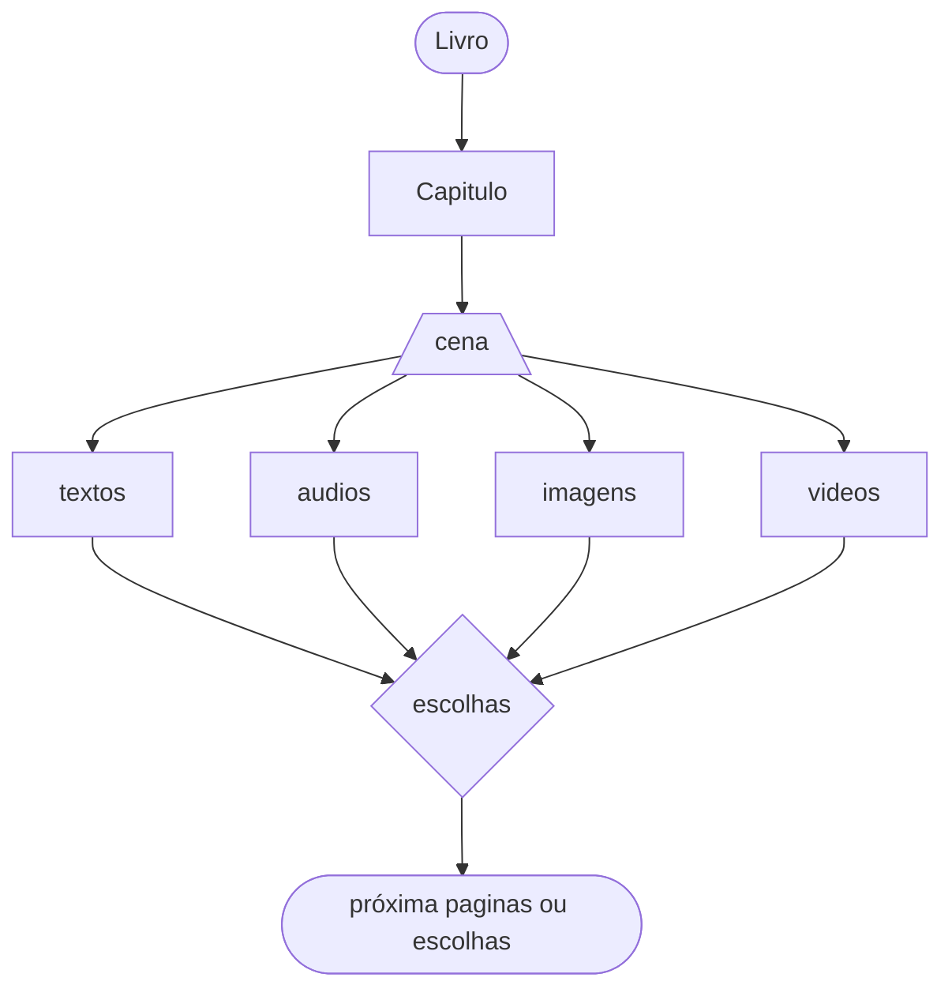

```mermaid

flowchart TD
    A([Livro]) --> B[Capitulo]
    B --> C[/cena\]
    C --> D[textos]
    C --> E[audios]
    C --> F[imagens]
    C --> G[videos]
    D --> H{escolhas}
    E --> H
    F --> H
    G --> H
    H --> I([próxima paginas ou escolhas])

```

